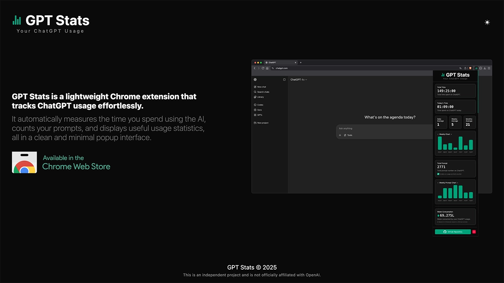
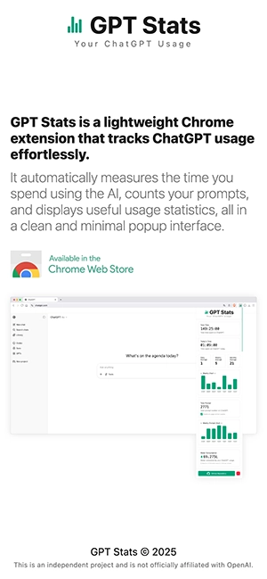

# GPT Stats Landing Page

## Description

This is the official landing page for the [GPT Stats Chrome extension](https://github.com/fchavonet/chrome_extension-gpt_stats).

It’s a simple and responsive one-page website designed to introduce the extension, highlight its key features, and redirect users to the official [Chrome Web Store](https://chromewebstore.google.com/detail/gpt-stats/gpicllelofjlednfbblbmjdlolpjonll?hl=fr) page for installation.

## Objectives

- Promote the GPT Stats Chrome extension with a clean and modern design.
- Provide direct access to the installation link via the Chrome Web Store.

## Tech Stack


## File Description

| **FILE**     | **DESCRIPTION**                                     |
| :----------: | --------------------------------------------------- |
| `assets`     | Contains the resources required for the repository. |
| `index.html` | Main HTML structure for the project.                |
| `style.css`  | Styles and animations for the project.              |
| `script.js`  | Behavior script for interactivity.                  | 
| `README.md`  | The README file you are currently reading 😉.       |

## Installation & Usage

### Installation

1. Clone this repository:
    - Open your preferred Terminal.
    - Navigate to the directory where you want to clone the repository.
    - Run the following command:

```
git clone https://github.com/fchavonet/full_stack-gpt_stats_landing_page.git
```

2. Open the cloned repository.

### Usage

1. Open the `index.html` file in your web browser.

You can also test the project online by clicking [here](https://fchavonet.github.io/full_stack-gpt_stats_landing_page/). 

<table>
    <tr>
        <th align="center" style="text-align: center;">Desktop view</th>
        <th align="center" style="text-align: center;">Mobile view</th>
    </tr>
    <tr valign="top">
        <td align="center">
            <picture>
                <source media="(prefers-color-scheme: dark)" srcset="./assets/images/screenshots/desktop_page_screenshot-dark.webp">
                <source media="(prefers-color-scheme: light)" srcset="./assets/images/screenshots/desktop_page_screenshot-light.webp">
                
            </picture>
        </td>
        <td align="center">
            <picture>
                <source media="(prefers-color-scheme: dark)" srcset="./assets/images/screenshots/mobile_page_screenshot-dark.webp">
                <source media="(prefers-color-scheme: light)" srcset="./assets/images/screenshots/mobile_page_screenshot-light.webp">
                
            </picture>
        </td>
    </tr>
</table>

## What's Next?

- Add dynamic previews from the extension, such as animated screenshots or GIF demonstrations.

## Thanks

- A big thank you to Hugo, my mentor at Holberton School, for his continuous guidance,
and to Alexis, intern at Holberton School, for his insightful feedback and support throughout the development.

## Author(s)

**Fabien CHAVONET**
- GitHub: [@fchavonet](https://github.com/fchavonet)
